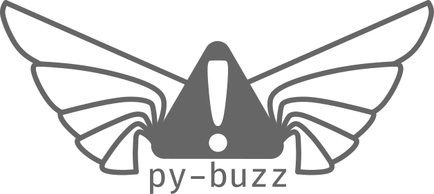

_That's not flying, it's falling with style_

Take Exceptions to infinity...and beyond with `py-buzz`!


## Overview

Have you ever found yourself writing the same code over and over to provide error handling in your python projects? I
certainly did. In fact, I found that I often needed to re-implement the same patterns in almost every project. These
patterns included:

* checking many conditions and reporting which ones failed
* catching exceptions and wrapping them in clearer exception types with better error messages
* checking conditions and raising errors on failure
* checking that values are defined and raising errors if they are not
* checking that values aer of a specific type and raising errors if they are not

This led me to create an exception toolkit called `py-buzz` that provides powerful helper tools for each of the cases
listed above. The `py-buzz` package intends to make your error handling easy, expressive, and robust.

Because `py-buzz` requires only Python itself, it's a very light-weight package that you can use in any project with
very little overhead.

`py-buzz` provides functionality or two different main use-cases. Either use-case allows you to focus on clear and
concise error handling in your project without a lot of repetitive code:


### `py-buzz` tools

This set of functions can be used with any exception type. So, if you already have a set of custom exceptions or simply
wish to use existing exceptions, you can import the py-buzz functions and use them in your code immediately. The helper
functions include:

- [`require_condition()`](features#raise-exception-on-condition-failure)
- [`enforce_defined()`](features#raise-exception-if-value-is-not-defined)
- [`ensure_type()`](features#raise-exception-if-value-is-wrong-type)
- [`handle_errors()`](features#exception-handling-context-manager)
- [`check_expressions()`](features#expression-checking-context-manager)


### `Buzz` base class

This class is meant to be used as a base class for custom exceptions that you can use in your project.
[`Buzz`](features#the-buzz-base-class) includes all of the helper functions as class methods that will use your custom
exception type.


## Quickstart

### Requirements

* Python 3.9 or greater


### Installation

This will install the latest release of py-buzz from pypi via pip:

```bash
pip install py-buzz
```


### Usage

Just import!

```python
from buzz import require_condition

require_condition(check_something(), "The check failed!")
```

For more examples of usage, see the [Features](features.md) page.


### Demos

`py-buzz` comes with an optional demo extra that can show you how to use the features. To install and run, try:

```bash
pip install py-buzz[demo]
py-buzz-demo
```

Alternatively, you can run them in one command using `uv`:

```bash
uvx --from=py-buzz[demo] py-buzz-demo
```
